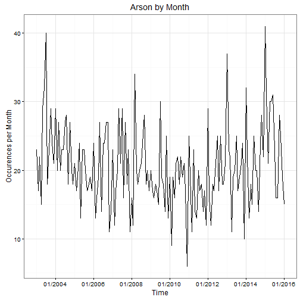

## Introduction

This app explores the history of crime in San Francisco by category. It plots  
the occurrences by week or by year of a chosen crime category. The data is for  
San Francisco crime between January 1, 2003 and January 13, 2016. 

The data can be found at:  
https://data.sfgov.org/Public-Safety/SFPD-Incidents-from-1-January-2003/tmnf-yvry

The project can be found at:  
https://kmok23.shinyapps.io/CrimeApp/

The project Github repository can be found at:  
https://github.com/kmok23/CrimeApp

--- .class #id 

## Features

The app loads the data and then displays the user controls as well as the
plot for the default crime category.

* Plot frequency of a type of crime over time
* User can switch the type of crime from a drop down menu
* User can switch the breaks in time between "months" and "years"
* Plot will update automatically

--- .class #id 

## Sample Plot

The plot below is a sample of the plot with Arson as the selected crime  
category and weeks as the time interval.  
 

--- .class #id 

## Conclusion

This app provides an easy way to visualize the historical data for a chosen  
crime. Future development of the app could include:

* Selection of intermediate time period (i.e. May 2015 - June 2015)
* Data filtered by police precinct or zip code
* Trend lines or other regression analyses

## Thank you

